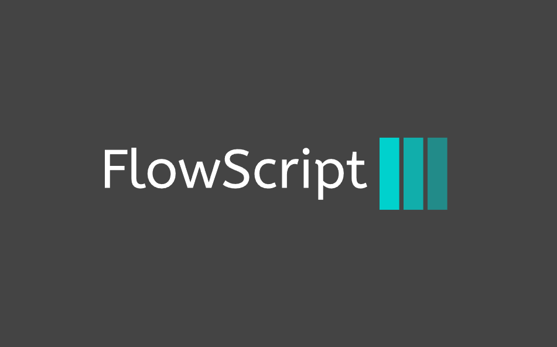

# FlowScript

    

FlowScript is a simple, lightweight scripting language designed to be easy to learn and use. It is built using Haxe and provides an intuitive syntax and powerful features for script-based programming.

## Features

* **Easy to learn**: FlowScript's syntax is designed to be intuitive and easy to understand, making it perfect for beginners and experienced programmers alike.
* **Lightweight**: FlowScript is built to be lightweight and efficient, allowing it to run smoothly on a wide range of devices.
* **Powerful features**: FlowScript provides a range of powerful features, including [list specific features, e.g. functions, loops, conditional statements, etc.].

## License

This project is licensed under the MIT License. See the [LICENSE](https://opensource.org/licenses/MIT) file for details.
